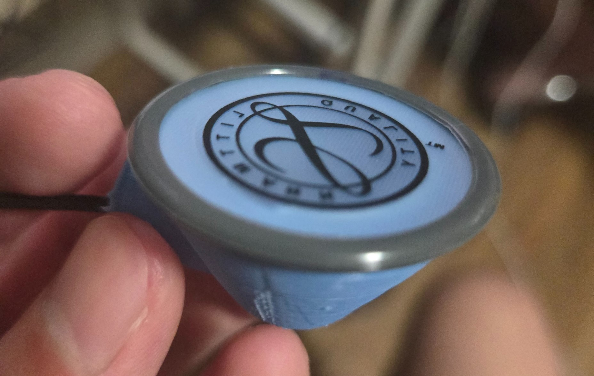

---
jupytext:
  formats: md:myst
  text_representation:
    extension: .md
    format_name: myst
kernelspec:
  display_name: Python 3
  language: python
  name: python3
---
# Microphone Recorder

This document outline how the recorder can be used as a stethoscope
This document contains:
- Overview of the microphone recorder
- Mold design of the recorder
- Sample sound

## Design
Here is the image of the recorder microphone



The picture above isn't the full story though. For this design we use
multiple modular parts, including the stethoscope head, the recorder, and the microphone.

```{image} ../image/sound_recorder.png
:alt: sound_recorder
:width: 300px
:align: center
```
```{image} ../image/microphone.jpg
:alt: sound_recorder
:width: 300px
:align: center
```

The main design of this device is from Dr. Lyndia Wu, I only modified the dimension and changed a
little bit of one part, mainly to make an airtight seal.

This device sound quality is great, it also allows you to hear directly if you plug in your
headphones in one of the jack. I personally find using this device easier, and a lot of the data I worked
with also come from this device.

To turn it on, simply hold down the power button down for 3 seconds until you hear a sound from the recorder.
Then insert your microphone to the microphone jack and the recorder should be recording.

## Mold Design
I provided the mold design in the github repo, it is in a solidworks file. If you prefer other file
format contact me and I'll gladly export it to you.

For the design, not much really to modify, devices works really great.

## Sample Sound

```{code-cell} python3
import numpy as np
import matplotlib.pyplot as plt
from scipy.io import wavfile
from IPython.display import Audio

audio_path = '../audio/recorder_sample.wav' 
sample_rate, data = wavfile.read(audio_path)

data = data/data.max()
audio = Audio(audio_path)
display(audio)

data = data / np.max(np.abs(data))

time = np.linspace(0, len(data) / sample_rate, num=len(data))

plt.figure(figsize=(14, 5))
plt.plot(time, data)
plt.title('Microphone Recorder Waveform')
plt.xlabel('Time (s)')
plt.ylabel('Amplitude')
plt.show()
```
