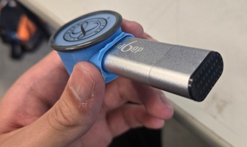

---
jupytext:
  formats: md:myst
  text_representation:
    extension: .md
    format_name: myst
kernelspec:
  display_name: Python 3
  language: python
  name: python3
---
# USB Recorder

This document outline how the USB microphone can be used as a stethoscope.
This document contains
- Overview of the USB recorder
- Mold design and how you can edit it
- Sample sound

## Design
The USB recorder is the one showed in the image below



The main benefit of this device compared to the recorder one is that everything
is in one piece, no dangling cable and such. So to record you just need to turn it on, and stick
it to area of interest.
However, you can't really hear your sound in real time, so you won't even know if your recording
is good or not. The microphone in this device is not the best as well, even the base usb recorder
records muffled sound.

## Mold Design
As you can imagine, the way to change this device is the mold design, I have the STEP format so you
can open and edit it with any CAD software you want. Mainly the thing that I want to experiment with
is the depth of the bowl shaped cavity.
Also one thing I would like to do but didn't have time too is to make a bigger hole, so that the microphone
have an easier time to pick up sound. The small hole opening might be the root cause of the muffled sound, but
I'm still not sure either so please experiment with it.

## Sample Sound

```{code-cell} python3
import numpy as np
import matplotlib.pyplot as plt
from scipy.io import wavfile
from IPython.display import Audio

audio_path = '../audio/100624_Gyan_Heartbeat_3Pulmonic_1.wav' 
sample_rate, data = wavfile.read(audio_path)

data = data/data.max()
audio = Audio(audio_path)
display(audio)

data = data / np.max(np.abs(data))

time = np.linspace(0, len(data) / sample_rate, num=len(data))

plt.figure(figsize=(14, 5))
plt.plot(time, data)
plt.title('USB Recorder Waveform')
plt.xlabel('Time (s)')
plt.ylabel('Amplitude')
plt.show()
```
