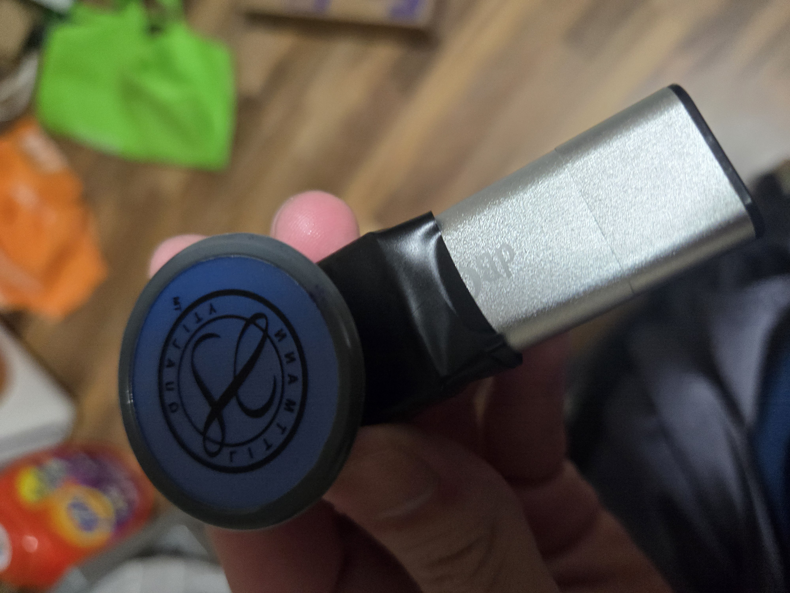
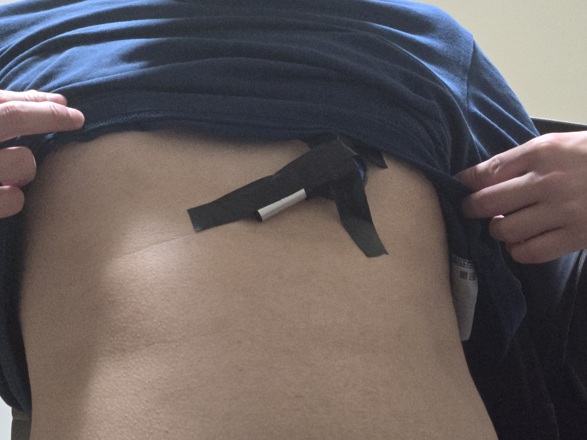

# 09/05/24 Weekly Report

## Progress

### Recording
I've recorded 2 trial run when I was sleeping.
Here are the images showing how the recording was taken.






### Dataset

Below are some datasets I found online that uses microphone or stethoscope as a recording device.
Some of them are annotated and verified by expert, and even used in research paper.
```{dropdown} Dataset List
[ICBHI](https://paperswithcode.com/dataset/icbhi-respiratory-sound-database)\
[HF Lung V1](https://gitlab.com/techsupportHF/HF_Lung_V1)\
[Fraiwan Data](https://data.mendeley.com/datasets/jwyy9np4gv/3)\
[Covid-19 Sounds](https://www.covid-19-sounds.org/en/blog/neurips_dataset.html#:~:text=To%20the%20best%20of%20our,%2C%20cough%2C%20and%20voice%20recordings.)\
[Kaggle, example](https://www.kaggle.com/datasets/vbookshelf/respiratory-sound-database/data)
```
### Machine Learning Algorithm

### Problem and Improvement 

## Challenge

### Dataset Validation

### Heartbeat detection

### Confused about ML Output

## Goals for Next Week

### Implement audio classification